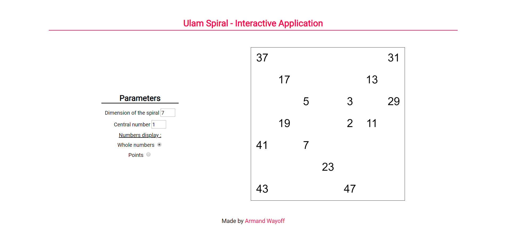

# Ulam Spiral

What's the [Ulam spiral](https://en.wikipedia.org/wiki/Ulam_spiral) ?

In this repository, I offer two versions of the Ulam spiral. 
The first is an interactive application written in JavaScript on which you can create your own Ulam spiral according to certain parameters.
The second is a version written in Python.

##  Interactive Application

[Visit the Application](https://editor.p5js.org/armandwayoff/present/q7rzZCcgv)

### Overview of the Application



## Python Version

Here is an example with a size ```15``` Ulam spiral starting at ```1```:

```
197	   	   	  	193	  	191	   	  	   	  	   	   	   	   
   	   	   	  	   	  	   	139	  	137	  	   	   	   	   
199	   	101	  	   	  	97 	   	  	   	  	   	   	   	181
   	   	   	  	   	  	   	61 	  	59 	  	   	   	131	   
   	   	103	  	37 	  	   	   	  	   	31	   	89 	   	179
   	149	   	67	   	17	   	   	  	13 	  	   	   	   	   
   	   	   	  	   	  	5  	   	3 	   	29	   	   	   	   
   	151	   	  	   	19	   	   	2 	11 	  	53 	   	127	   
   	   	107	  	41 	  	7  	   	  	   	  	   	   	   	   
   	   	   	71	   	  	   	23 	  	   	  	   	   	   	   
   	   	109	  	43 	  	   	   	47	   	  	   	83 	   	173
   	   	   	73	   	  	   	   	  	79 	  	   	   	   	   
   	   	   	  	113	  	   	   	  	   	  	   	   	   	   
   	157	   	  	   	  	   	163	  	   	  	167	   	   	   
211	   	   	  	   	  	   	   	  	   	  	   	223	   	   
```
